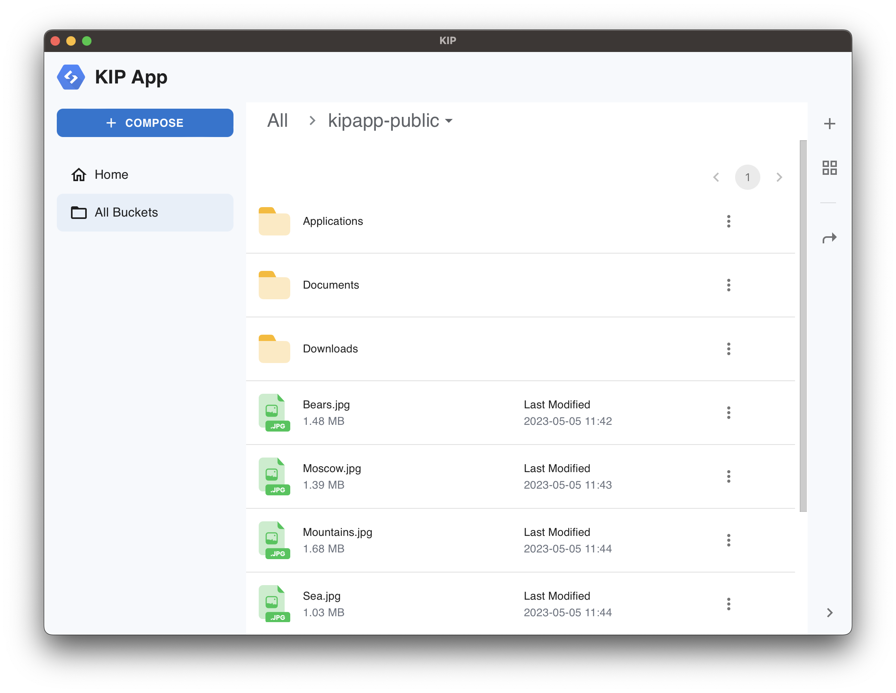

## Features

<!-- - 💯 Connect to one or more clusters simultaneously -->
<!-- - ⚡️ Aggregated Log Viewer -->
<!-- - 💪 Human-friendly resource view -->
<!-- - ✍️ View & modify objects -->
<!-- - 🎉 Zero-config setup -->
- 😉 **NOT** another Electron app
<!-- - ✅ Works with any Kubernetes cluster: on-prem, GKE, EKS, AKS and others. -->
- 💻 Available on Windows, macOS and Linux

Visit [getkipapp.com](https://www.getkipapp.com?utm_campaign=github_readme) to learn more.

## Download

- [Download KIP App](https://www.getkipapp.com)
- [Changelog](https://www.getkipapp.com/changelog)

## Need help?

- Join us on [Telegram](https://t.me/kipapp_community)
- Find us on [Twitter](https://twitter.com/kip_app)
- Open a Github issue or a discussion 
<!-- - Shoot us an email hello@aptakube.com -->
<!-- 
---

❤️ Love Aptakube? Give us a shoutout 👉 [https://love.aptakube.com/r/ASb0RG](https://love.aptakube.com/r/ASb0RG?utm_medium=github) -->